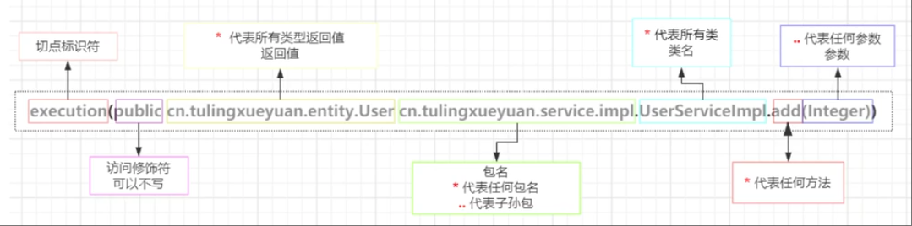

## 项目的框架结构
通过 maven 管理多个模块。
最外层的父模块中，直接删除 src 目录，将 pom.xml 文件中，增加 packaging 属性，且值为 `pom`。

```xml
<?xml version="1.0" encoding="UTF-8"?>
<project xmlns="http://maven.apache.org/POM/4.0.0" xmlns:xsi="http://www.w3.org/2001/XMLSchema-instance"
         xsi:schemaLocation="http://maven.apache.org/POM/4.0.0 https://maven.apache.org/xsd/maven-4.0.0.xsd">
    <!--   
    略...
    -->

    <packaging>pom</packaging>
    
    <!--   
    略...
    -->
</project>
```

增加子模块声明：

```xml
<?xml version="1.0" encoding="UTF-8"?>
<project xmlns="http://maven.apache.org/POM/4.0.0" xmlns:xsi="http://www.w3.org/2001/XMLSchema-instance"
         xsi:schemaLocation="http://maven.apache.org/POM/4.0.0 https://maven.apache.org/xsd/maven-4.0.0.xsd">
    <!--   
    略...
    -->

    <modules>
      <module>hello1</module>
      <module>exa_aop</module>
    </modules>
    
    <!--   
    略...
    -->
</project>
```

需要注意的是对应的子模块中的 pom 文件中的 parent 部分 artifactId 是否指向父模块：

```xml
<!-- 子模块的 pom： -->
<!--  略... -->
<parent>
  <groupId>com.xs</groupId>
  <artifactId>spring0</artifactId>
  <version>0.0.1-SNAPSHOT</version>
</parent>
<!--  略... -->

<!-- 父模块的 pom： -->
<!--  略... -->
<parent>
  <groupId>org.springframework.boot</groupId>
  <artifactId>spring-boot-starter-parent</artifactId>
  <version>3.4.2</version>
  <relativePath/> <!-- lookup parent from repository -->
</parent>
<groupId>com.xs</groupId>
<artifactId>spring0</artifactId>
<version>0.0.1-SNAPSHOT</version>
<!--  略... -->
```

后续基于当前父模块，创建多个子模块进行开发。如下图所示：


## 注解
### @Autowired


### @Value
当 @Value 注解作用在类的属性上时，表示向该属性注入对应的值。如 Integer，String 类型等

```java
@Component
public class UserDomain {
    @Value("刘德华")
    private String name;
    @Value("42")
    private Integer age;
}
```

还可以通过 @PropertySource 注解，将配置文件中的值进行注入：

```java
/// UserDao.java
@PropertySource("someConfig2.properties")
public class UserDomain {
    // ...
    @Value("${u1.skills:PHP}")
    protected String skills;
}
```

```
/// [someConfig2.properties](../hello1/src/main/resources/someConfig2.properties)
u1.skills = "PHP,Golang,Java"
u1.age = "39"
```

如果配置文件中的对应的 key 不存在，可以制定一个默认值：

```java
/// UserDao.java
@PropertySource("someConfig2.properties")
public class UserDomain {
    // ...
    @Value("${u1.skills:PHP}")
    protected String skills;
}
```

可以通过在 `:` 后，指定对应的默认值。如果默认值也不提供，在 Springboot 中则会报错，因为该机制在 springboot 中更严格。
而在 spring 中，key 不存在时，则不回报错，默认会将 key 对应的”名称“作为值使用，如 `${u1.skills}`。

### @Order/@DependsOn
通过 @Order/@DependsOn 注解可改变 Bean 实例化的顺序。

### @Lazy
通过 @Lazy 注解实现 Bean 的懒加载。从而优化应用的启动速度。

当然，也可以通过在 application.properties 配置文件中添加一下配置，实现所有 Bean 的懒加载。

```properties
spring.main.lazy-initialization=true
```

### @Scope
通过该注解，实现 Bean 对象的单例模式和多例模式。如：`@Scope("singleton")`，`@Scope("prototype")`

### @Conditional
动态决定某个 Bean 是否生效。

```java
@SpringBootTest(classes = TestConditional.class)
public class TestConditional {

    @Bean
    @Conditional(MyConditional.class)
    public ConditionalService conditionalService() {
        return new ConditionalService();
    }
}
```

其中 `MyConditional.class` 是自己定义的实现了 `org.springframework.context.annotation.Condition` 接口的类。
由其返回值确定对应的 Bean 是否生效。

### Bean 的生命周期
#### 生命周期-开始：@PostConstruct
通过 @PostConstruct 注解实现。

```java
public class BeanLifetimeService implements InitializingBean{

    @PostConstruct
    public void init1() {
        System.out.println("BeanLifetimeService init1");
    }
}
```

#### 生命周期-开始：Bean 注解参数 initMethod
可以对 `@Bean` 注解传入参数：`@Bean(initMethod = "init2")`，从而指定初始化时的钩子方法。

```java
@SpringBootTest(classes = TestBeanLifetime.class)
public class TestBeanLifetime {

    @Bean(initMethod = "init2")
    public BeanLifetimeService beanLifetimeService() {
        return new BeanLifetimeService();
    }
}
```

#### 生命周期-开始 
通过实现 `org.springframework.beans.factory.InitializingBean` 接口，可以清楚地看到 Bean 的生命周期中，开始时的相关调用。

```java
import org.springframework.beans.factory.InitializingBean;

public class BeanLifetimeService implements InitializingBean{
    @Override
    public void afterPropertiesSet() throws Exception {
        System.out.printf("BeanLifetimeService afterPropertiesSet");
    }
}
```

以上 3 中方式中的优先级：@PostConstruct > initMethod > InitializingBean 接口。

#### 生命周期-结束：基于接口

```java
import org.springframework.beans.factory.DisposableBean;

public class BeanLifetimeEndService implements DisposableBean {
    @Override
    public void destroy() throws Exception {
        System.out.println("BeanLifetimeEndService destroy");
    }
}
```

#### 生命周期-结束：基于注解 @PreDestroy

```java
public class BeanLifetimeEndService implements DisposableBean {
    // ...

    @PreDestroy
    public void destroy2() {
        System.out.println("BeanLifetimeEndService destroy2");
    }
}
```

#### 生命周期-结束：Bean 注解参数 destroyMethod

```java
@SpringBootTest(classes = TestBeanLifetime.class)
public class TestBeanLifetime {

    // ...

    @Bean(destroyMethod = "destroy2")
    public BeanLifetimeEndService beanLifetimeEndService() {
        return new BeanLifetimeEndService();
    }
}
```


需要注意的是，springboot 中，当 jvm 进程结束后，会自动调用 ioc 容器的销毁方法 `close`。
而在 spring 中，则需要手动调用销毁方法。

## 循环依赖
在 spring 中，可以进行循环依赖。

而在 springboot 中，默认情况下，循环依赖被认为是一种不合理的设计，因此会报错。

解决方式 1:

可以通过增加特殊的配置项，达到支持的目的：

```xml
# 放开循环依赖的限制
spring.main.allow-circular-references = true
```

不过，即使如此，循环依赖也是不建议使用的。

解决方式 2:

调整代码的设计和组织，独立出相应的逻辑。

解决方式 3:

通过延迟注入的方式也可以解决。

## SpringAOP 面向切面编程
AOP：Aspect Oriented Programming

切面：主要是“增强”作用。在不改变原有代码的基础上进行增强（额外运行“切面”中的代码）

启用 AOP，需要添加注解 `@EnableAspectJAutoProxy`，否则， AOP 功能无法使用。

不过，如果**启动类和切面代码位于同一个包**中，则默认可以使用。
原因是：启动类中有 @SpringBootApplication 注解，该注解中，此时，自动加上了 `@EnableAspectJAutoProxy` 注解。

```java
// @SpringBootApplication 注解中，自动启用了 @EnableAspectJAutoProxy
@SpringBootApplication
public class MyAopApplication {
    public static void main(String[] args) {
        SpringApplication.run(MyAopApplication.class, args);
    }
}
```

即使如此，真正使用时，建议还是加上 `@EnableAspectJAutoProxy` 注解。

```java
package com.exa_aop.aopService;

import org.junit.jupiter.api.Test;
import org.springframework.beans.factory.annotation.Autowired;
import org.springframework.boot.test.context.SpringBootTest;
import org.springframework.context.annotation.ComponentScan;
import org.springframework.context.annotation.EnableAspectJAutoProxy;

@SpringBootTest(classes = ExaAopApplicationTests.class)
@ComponentScan
@EnableAspectJAutoProxy // -->启用 AOP 代理
public class ExaAopApplicationTests {

    @Test
    public void test1(@Autowired UserService userService) {
        userService.getUserList();
        System.out.printf("end...\n");
    }
}
```

以上，是针对 springboot。如果是 spring，对应注解是必须要加的。

通过 `@Aspect` 可将一个类标记为切面类：

```java
import org.aspectj.lang.ProceedingJoinPoint;
import org.aspectj.lang.annotation.Around;
import org.aspectj.lang.annotation.Aspect;
import org.springframework.stereotype.Component;

@Component
@Aspect  // 标记为切面类
public class LogAspect {

    // @Around：环绕通知。“通知”类型之一。
    // execution() 中写“切点表达式”
    @Around("execution(* com.exa_aop.aopService.UserService.*(..))")
    public void log(ProceedingJoinPoint proceedingJoinPoint) {
        long t1 = System.currentTimeMillis();

        // 执行具体的方法、逻辑
        try {
            proceedingJoinPoint.proceed();
        } catch (Throwable e) {
            System.out.println("fn exec error:" + e.getMessage());
        }
        long t2 = System.currentTimeMillis();

        System.out.printf("time consume: %d s \n", (t2 - t1));
    }
}
```

通过特定注解，将方法设定为特定的执行动作。一般包含以下几种类型：

- 环绕通知 `@Around`：可以把代码增加在目标方法的任意地方，更通用
- 前置通知 `@Before`：目标方法之前执行
- 后置通知 `@After`：目标方法之后执行
- 异常通知 `@AfterThrowing`：目标方法出现了异常时执行
- 返回通知 `@AfterReturning`：目标方法 return 之后执行

**切点**：通过“切点表达式”，设定代码要切入到哪些方法中。

**连接点**：“通知”和目标方法的一个桥梁。例如：上方示例代码中的 `proceedingJoinPoint` 对象。

### “返回通知”的使用
“返回通知”对应的注解是 `@AfterReturning`，用于被增强的方法执行之后，执行的逻辑。例如有如下定义的增强代码：

```java
@AfterReturning(value="execution(* com.exa_aop.aopService.UserService.*(..))", returning = "returnValue")
public void afterReturningFn(JoinPoint joinPoint, Object returnValue) {
    String methodName = joinPoint.getSignature().getName();
    System.out.printf("afterReturningFn %s \t return: %s \n", methodName, returnValue);
}
```

注解中，我们不仅可以指定“切点表达式”，还可以通过参数名，指定其他注解参数，如上方代码所示的 `returning` 参数名。

而且 `returning` 的值需要与增强方法的形参对应 `Object returnValue`。

### “异常通知”的使用
“异常通知” 是在方法抛出异常时，才会执行。如果没有发生异常，则不会执行。

```java
@AfterThrowing("execution(* com.exa_aop.aopService.UserService.*(..))")
public void afterThrowing1(JoinPoint joinPoint) {
    String methodName = joinPoint.getSignature().getName();
    System.out.printf("afterThrowing1 %s \t %s \n", methodName);
}
```

需要注意的是，当“异常通知”执行时，意味着“返回通知”不会执行。

此外，“异常通知”对应的增强代码中，可以在注解中按需要增加参数：

```java
@AfterThrowing(value = "execution(* com.exa_aop.aopService.UserService.*(..))", throwing = "exceptionObj")
public void afterThrowing2(JoinPoint joinPoint, Exception exceptionObj) {
    String methodName = joinPoint.getSignature().getName();
    System.out.printf("afterThrowing2 %s \t %s \n", methodName, exceptionObj.getMessage());
}
```

如上方所示，可以拿到对应的异常对象。

### 关于“后置通知”
“后置通知” 类似于 try 表达式中的 finally 部分的表达式。

```java
public void trySomeFn1() {
    try {
        throw new Exception("err message 1002");
    } catch (Exception e) {
        System.out.printf("trySomeFn1 catch\n");
    } finally {
        System.out.printf("trySomeFn1 finally\n");
    }
}
```

### 切点表达式



包名中，`..` 可以代表任意层级（包名）。如：`execution(* com..UserService.*(..))`，则可以表示 `execution(* com.exa_aop.aopService.UserService.*(..))`

#### 切点表达式的引用
为了避免在多个地方写同样的切点表达式,可以通过声明一个"空"方法,并加上注解 @Pointcut 可以实现一个地方编写,其他任意地方引用的效果.

```java
@Component
@Aspect
public class MyPointCut {
    @Pointcut("execution(* com.exa_aop.aopService.UserService.*(..))")
    public void testExecPointCut1(){}

    // “前置通知”.只需要引用 `testExecPointCut1()` 即可
    @Before("testExecPointCut1()")
    public void beforeFn(JoinPoint joinPoint) {
        String methodName = joinPoint.getSignature().getName();
        Object[] args = joinPoint.getArgs();
        System.out.printf("beforeFn %s \t %s \n", methodName, args);
    }
}
```

"切点标识符"除了 `execution` 还有其他的,比如: 
- `within`
  - `within(包名, 类名?)` (`?` 表示可选项)
  - 只能匹配到类级别,粒度较粗
- `annotation`
  - `@annotation(com.exa_aop.aopService.UserService.*(..))`
  - 可以定位到具体的方法,粒度更细
- `this`
- `target`

切点表达式中,还可以使用逻辑运算符, 例如 `&&`:

```java
@Component
@Aspect
public class MyPointCut {
    @Pointcut("execution(* com.exa_aop.aopService.UserService.*(..))")
    public void testExecPointCut1(){}

    @Pointcut("within(com.exa_aop.aopService.ProjectService)")
    public void testExecPointCut2(){}

    // “前置通知”
    @Before("testExecPointCut1()")
    public void beforeFn(JoinPoint joinPoint) {
        String methodName = joinPoint.getSignature().getName();
        Object[] args = joinPoint.getArgs();
        System.out.printf("MyPointCut.beforeFn %s \t %s \n", methodName, args);
    }

    // --> 使用逻辑运算符,连接多个切点表达式
    @Before("testExecPointCut1() && testExecPointCut2()")
    public void beforeFn2(JoinPoint joinPoint) {
        String methodName = joinPoint.getSignature().getName();
        Object[] args = joinPoint.getArgs();
        System.out.printf("MyPointCut.beforeFn2 %s \t %s \n", methodName, args);
    }
}
```

可以自己定义一个注解,然后针对特定方法使用自己定义的注解,使用这种方式,对匹配到的方法进行切入:

```java
/// exa_aop/src/test/java/com/exa_aop/aopService/AnnLog1.java
// 针对所有使用了 `@AnnLog1` 注解的方法,进行切入
@Pointcut("@annotation(AnnLog1)")
public void testExecPointCut3(){}

@Before("testExecPointCut1() && testExecPointCut2() && testExecPointCut3()")
public void beforeFn2(JoinPoint joinPoint) {
    String methodName = joinPoint.getSignature().getName();
    Object[] args = joinPoint.getArgs();
    System.out.printf("MyPointCut.beforeFn2 %s \t %s \n", methodName, args);
}

/// exa_aop/src/test/java/com/exa_aop/aopService/ProjectService.java
@AnnLog1("修改 project")
public void edit() {
    System.out.println("edit...");
}
```

如果在编写增强代码时,需要获取自定义注解对应的参数时,则以上的方式需要有所调整:

```java
///  exa_aop/src/test/java/com/exa_aop/aopService/MyPointCut.java
@Before("@annotation(log)")
public void beforeFn3(JoinPoint joinPoint, AnnLog1 log) {
    String methodName = joinPoint.getSignature().getName();
    Object[] args = joinPoint.getArgs();
    System.out.printf("MyPointCut.beforeFn3 methodName: %s, 注解的参数值: %s \n", methodName, log.value());
}
```


